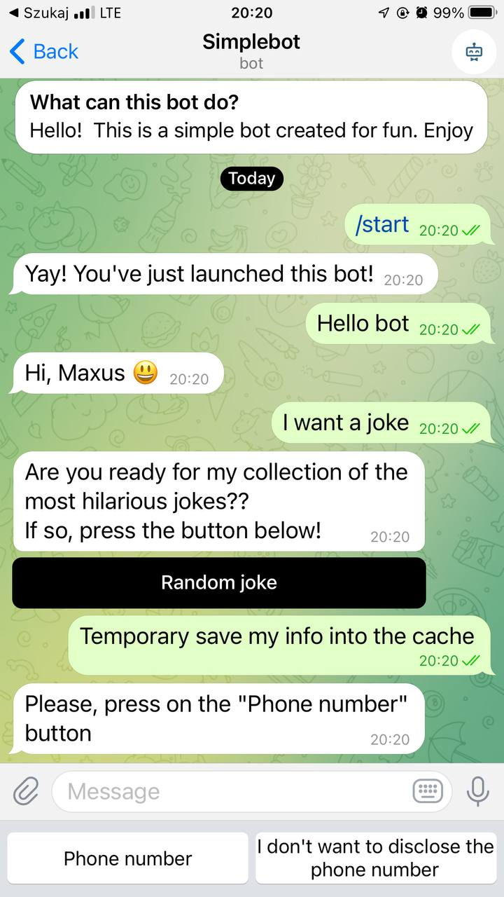
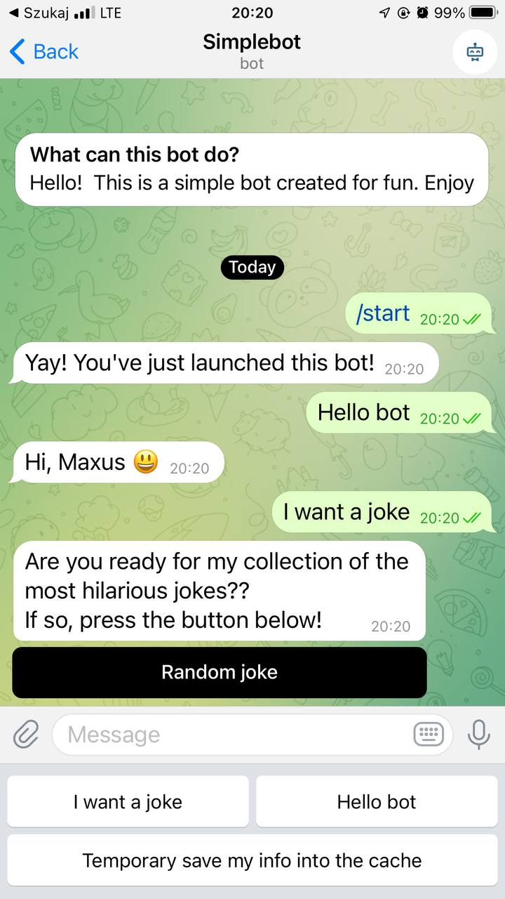
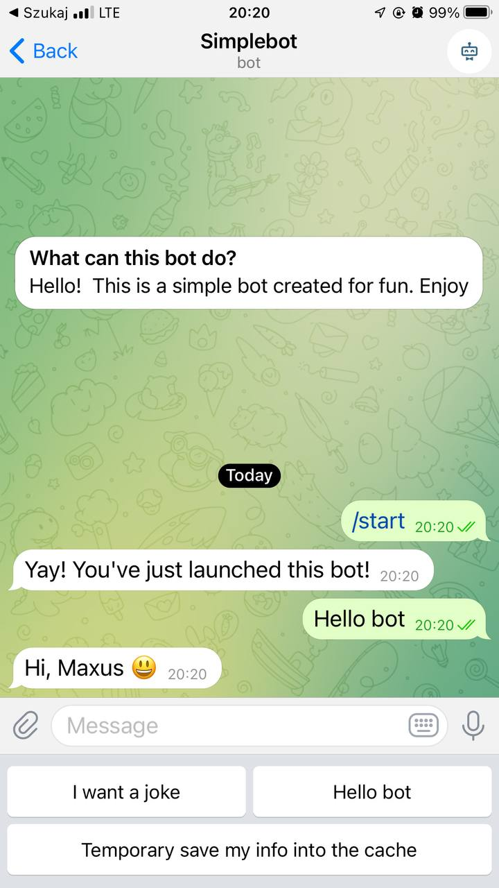
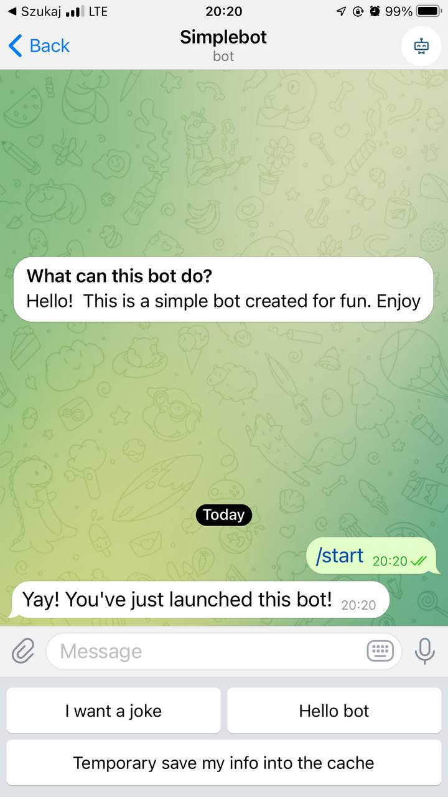

# :robot: Telegram Bot

Simple telegram bot for ertainment purposes only

## 🛠Backend API
**Stack**: 
- Java 17
- Spring Boot 
  
**Features**:
- Saving user data 
- Ertainment jokes
- Deployed to Heroku

## Example Pictures

---

## Where to access the bot
Go to https://telegram.me/simpleInteractiveBot and enjoy :smiley:
